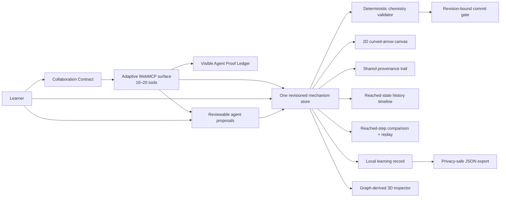

# Mechanism Canvas

Mechanism Canvas is a **proof-carrying visual tutor**: a learner decides how much help an agent may provide, WebMCP exposes only those permitted actions, and a deterministic domain engine—not the model—decides whether the work is correct.

Its **Agent Proof Ledger** closes the loop between a tool definition and what the page actually did. Every Site Tool invocation produces a visible, privacy-minimized receipt with the active contract, outcome, affected semantic IDs, and before/after state stamps. Learners and judges can inspect or export the same evidence the agent can read.

Organic chemistry is the first proving ground. The broader contribution is a human-agent contract for any visual STEM workspace where meaning lives behind pixels: circuit editors, geometry canvases, data-flow diagrams, CAD tools, and simulations.

[Open a clean demo](https://mihirduvedi.github.io/mechanism-canvas/?demo=1) · [Read the judge guide](docs/JUDGE_GUIDE.md) · [View the demo script](docs/DEMO_SCRIPT.md)

## The problem it solves

Today's AI learning tools force a bad choice:

- A chatbot can explain a diagram, but it sits outside the learner's exact live work and can invent what changed.
- A screenshot agent can click coordinates, but pixels do not encode stable objects, coupled operations, revision conflicts, or domain invariants.
- An unrestricted copilot can finish the task, but “please do not give me the answer” is a prompt request—not an enforceable learning boundary.

That last distinction matters. A field experiment with nearly 1,000 students found that unguarded GPT access improved assisted practice performance but hurt later unassisted performance; purpose-built safeguards largely mitigated the harm ([Bastani et al., PNAS 2025](https://doi.org/10.1073/pnas.2422633122)). Mechanism Canvas turns that design lesson into product architecture.

The learner-owned **Collaboration Contract** has three modes:

- **Observe** exposes 10 read, focus, comparison, replay, and receipt tools.
- **Coach** exposes 15 tools, including bounded checks, hints, and reviewable proposals, while the learner owns every arrow and commit.
- **Collaborate** exposes up to 20 revision-bound tools; the learner can still keep final commits learner-only.

Changing the contract updates the live WebMCP tool surface. There is deliberately no Site Tool that can change the contract. The store also rejects forbidden agent calls, so hiding a tool is not the only guard.

## Why WebMCP is the necessary interface

A curved-arrow mechanism is easy to see and surprisingly hard to operate from pixels. The same dot can mean a lone pair, the same line can mean a bond, and a chemically valid step may require multiple arrows applied together. Coordinate clicks do not tell an agent which electron pair moved or whether it acted on the learner's current revision.

Only the open application possesses all three facts required for safe tutoring at once: the exact semantic graph, the learner's current permission contract, and the validator's current revision. WebMCP lets the page expose those facts and its existing commands directly instead of asking an agent to infer them or recreate the rules.

The result is not “AI that answers chemistry.” It is a shared workspace where help carries proof: what the agent was allowed to do, which semantic objects it acted on, which learner gate approved it, and which deterministic check authorized the transition.



There is no agent-only state, hidden model grader, prompt-only permission, or second implementation of the chemistry commands.

## The judge path

Open the [clean demo](https://mihirduvedi.github.io/mechanism-canvas/?demo=1) in ChatGPT's built-in browser. It starts in **Coach** mode with 15 of 20 tools. Select **Collaborate** but leave **Only I can commit checked steps** enabled; the discoverable surface expands to 19 of 20 tools. Then ask:

> Use this page's Site Tools and keep every change visible. Read the collaboration contract and clean demo state, confirm that direct editing is enabled but commits are learner-only, then switch to ammonia_alkylation_01. Add only lp_n_attack_1 → c_methyl and check the incomplete first step. Use propose_draft_arrows to stage only bond_c_br → br_leaving with a brief rationale, confirm that staging did not change the draft or revision, then call get_agent_action_receipts with afterSequence 0 and limit 12. Distinguish the receipt evidence from your explanation, then stop for my decision.

Select **Add to my draft**, ask the agent to check the now-complete draft, then select **Commit checked step** yourself—the commit tool is absent because the learner kept that boundary. Continue with comparison, replay, the second step, the shared activity trail, and one-step undo.

That journey demonstrates adaptive tool discovery, stable entity IDs, an intentionally incomplete attempt, deterministic feedback, a visible agent proposal, a learner-only commit, reached-state evidence, structured provenance, and reversibility. The [judge guide](docs/JUDGE_GUIDE.md) contains the exact route.

## Site tools

| Tool | Available in | Contract |
|---|---|---|
| `get_mechanism_state` | All modes | Read the active problem, revision, draft, check, stable entity IDs, and current collaboration contract. |
| `get_collaboration_contract` | All modes | Read the learner-owned mode, hint ceiling, commit boundary, revision, and enabled tool names. No tool can change it. |
| `get_agent_action_receipts` | All modes | Read privacy-minimized execution receipts incrementally, including page outcomes and before/after state stamps. |
| `get_learning_profile` | All modes | Read privacy-local cross-exercise evidence and next-practice rankings without exposing answers. |
| `inspect_mechanism_entities` | All modes | Read atom, bond, or lone-pair data for named IDs. |
| `get_activity_trail` | All modes | Read human, agent, validator, and contract events incrementally. |
| `view_mechanism_history_state` | All modes | Show only a reached state without changing committed chemistry. |
| `compare_reached_step` | All modes | Read exact graph and electron-bookkeeping changes for an active committed transition. |
| `replay_reached_step` | All modes | Present the performed arrows without applying chemistry again. |
| `focus_mechanism_entities` | All modes | Focus named entities on the visible canvas and record the action. |
| `propose_practice_plan` | Coach, Collaborate | Stage a 1–3 exercise plan for visible learner approval. |
| `propose_draft_arrows` | Coach, Collaborate | Stage 1–4 revision-bound arrows for visible learner approval without changing the draft. |
| `check_draft_step` | Coach, Collaborate | Run the deterministic validator without committing chemistry. |
| `request_scaffold` | Coach, Collaborate | Open only a hint level at or below the learner's current ceiling. |
| `switch_problem` | Coach, Collaborate | Change exercises while retaining separate local progress. |
| `add_draft_arrow` | Collaborate | Add one arrow against an expected revision. |
| `remove_draft_arrow` | Collaborate | Remove one named draft arrow against an expected revision. |
| `undo_last_commit` | Collaborate | Restore the prior structure and keep the provenance record. |
| `reset_active_exercise` | Collaborate | Clear one exercise only after explicit confirmation and a revision check. |
| `commit_checked_step` | Collaborate + learner opt-in | Commit only a current valid check token when the learner shares that authority. |

The mutating tools reject stale revisions. A draft edit invalidates its previous validation token, and a refresh never restores commit authority.

## What is implemented

- Six chemistry-reviewed fixtures: three SN2 exercises, two proton-transfer exercises, and a two-step ammonia-alkylation capstone with a charged intermediate.
- Clickable and keyboard-operable SVG atoms, bonds, and lone pairs.
- Atomic multi-arrow validation with distinct incomplete, invariant-error, authored-path, accepted, and invalid-input results.
- Explicit check, revision-bound commit, undo, reset, per-problem local persistence, and shared actor provenance.
- A reviewable agent-proposal gate: WebMCP can stage structured arrows, but only the learner-facing UI can accept or decline them; accepting still requires a separate deterministic check.
- Four progressive scaffold levels per exercise.
- A lazy-loaded Three.js inspector generated from the same molecular graph, including implicit hydrogens, bond order, lone pairs, formal charge, polarity, and VSEPR geometry.
- A reached-state reaction timeline that locks future states and keeps history browsing read-only.
- Reached-step evidence: a responsive before/after comparison with collision-safe shared molecule rendering, exact bond and atom-property deltas, undo-aware reachability, and an Electron Flow Replay of the performed arrows.
- Learner reflections attached to exact commits, including reversed commits, without changing chemistry revision or validation authority.
- A compact local instructor view for checks, hints, performed arrow bundles, reversals, and learner reflections.
- A privacy-local Practice Compass that derives cross-exercise evidence from exact checks, hints, and completed steps, then ranks next practice without claiming mastery.
- A second human-agent approval gate: WebMCP can stage a revision-bound practice plan, but only the learner-facing UI can start or dismiss it.
- An active-exercise JSON learning record with download and clipboard paths; the allowlisted schema omits accepted-answer definitions, unreached state graphs, validation IDs, and dedicated learner identity fields.
- A learner-owned Collaboration Contract whose three modes expose 10–20 WebMCP tools, cap agent hints, and optionally keep commits learner-only.
- An Agent Proof Ledger that centrally instruments every Site Tool call, distinguishes verified, guarded, failed, and canceled outcomes, and exposes the privacy-minimized receipts to both the page and agent.
- Twenty top-level imperative WebMCP tools backed by the same store as the human interface, registered through an abortable adaptive surface.
- An isolated `?demo=1` session that always starts from clean SN2 reactants, reports its temporary state to the agent, and never reads or changes saved practice.

## Trust boundaries

All six fixtures are chemistry reviewed and pass automated structure, transition, and negative-case checks. The app remains a bounded educational tool, not a reaction predictor or chemistry authority.

The validator is deterministic and fixture-bound. The 3D view is explanatory rather than a quantum calculation, molecular-dynamics simulation, conformer prediction, or claim about kinetics. Progress stays in the browser: there is no account, backend, model API call, telemetry pipeline, or cloud sync. Learning-record exports are generated only after a learner selects Download JSON or Copy JSON; Mechanism Canvas does not upload them.

WebMCP support depends on a compatible host exposing `document.modelContext`. The complete manual interface still works when site tools are unavailable.

## Run and verify

Requires Node.js 24 or a current compatible Node release.

```bash
npm ci
npm run verify
npm run dev
```

`npm run verify` runs the full Vitest contract suite, TypeScript build, and production bundle. The public deployment uses the same command in GitHub Actions before Pages publishes `dist/`.

## Project map

| Area | Source of truth |
|---|---|
| Domain model and validator | `src/domain/` |
| Reviewed fixture boundary | `src/problems/` |
| Shared command store and v6 persistence | `src/store/mechanism-store.ts` |
| Collaboration Contract policy | `src/domain/collaboration-contract.ts`, `src/components/CollaborationContract.tsx`, and `docs/COLLABORATION_CONTRACT.md` |
| WebMCP registration | `src/webmcp/register-tools.ts` |
| Agent Proof Ledger | `src/webmcp/tool-receipt-ledger.ts`, `src/components/AgentProofLedger.tsx`, and `docs/AGENT_PROOF_LEDGER.md` |
| Visible workspace | `src/components/` |
| Learning-record schema and privacy allowlist | `src/domain/learning-record.ts` and `docs/LEARNING_RECORD.md` |
| Reached-step comparison engine | `src/domain/mechanism-comparison.ts` and `docs/REACTION_DIFF.md` |
| Electron Flow Replay | `src/domain/reaction-replay.ts`, `src/components/mechanism-arrow-layout.ts`, and `docs/ELECTRON_FLOW_REPLAY.md` |
| Reviewable agent proposals | `src/store/mechanism-store.ts`, `src/components/ReasoningPanel.tsx`, and `docs/AGENT_DRAFT_PROPOSALS.md` |
| Practice Compass | `src/domain/practice-compass.ts`, `src/components/PracticeCompass.tsx`, and `docs/PRACTICE_COMPASS.md` |
| Six-fixture problem library | `src/problems/library-expansion.ts` and `docs/PROBLEM_LIBRARY_EXPANSION.md` |
| Visual system | `src/index.css` and `DESIGN.md` |
| Chemistry review packets | `docs/chemistry-review/` |
| Product requirements | `docs/mechanism-canvas-prd.md` |

## License

Code is available under the [MIT License](LICENSE). Chemistry fixtures and interface copy are original project content distributed with this repository under the same license.
