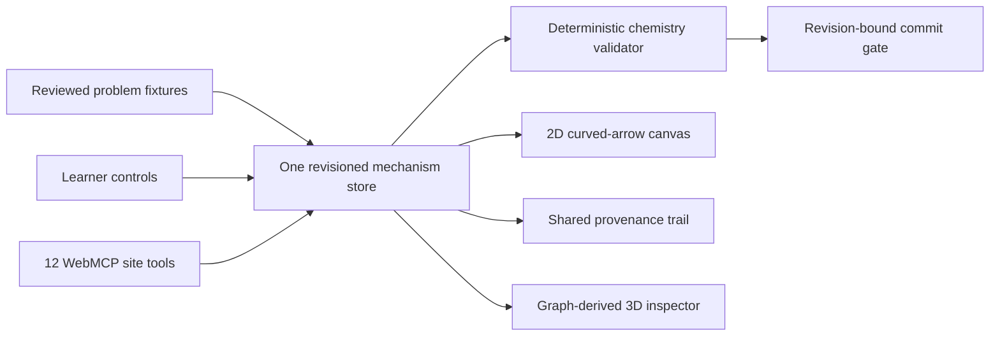

# Mechanism Canvas

Mechanism Canvas is a shared organic chemistry workspace where a learner and a WebMCP agent work on the same live reaction mechanism. The agent reads stable chemical entities and uses narrow domain actions; the app's deterministic chemistry engine decides whether an arrow bundle is accepted.

[Open the live app](https://mihirduvedi.github.io/mechanism-canvas/) · [Read the judge guide](docs/JUDGE_GUIDE.md) · [View the demo script](docs/DEMO_SCRIPT.md)

## Why this needs WebMCP

A curved-arrow mechanism is easy to see and surprisingly hard to operate from pixels. The same dot can mean a lone pair, the same line can mean a bond, and a chemically valid step may require multiple arrows applied together. Coordinate clicks do not tell an agent which electron pair moved or whether it acted on the learner's current revision.

Mechanism Canvas exposes that meaning directly. An agent can discover the available exercises, inspect atom and bond IDs, add one visible arrow, ask the deterministic validator to check the full bundle, and commit only a current valid result. Every action lands in the same store, canvas, and activity trail the learner sees.



There is no agent-only state, hidden model grader, or second implementation of the chemistry commands.

## The judge path

Open the live app in ChatGPT's built-in browser with Site tools enabled, then ask:

> Use this page's site tools and keep every change visible. Read the current mechanism state. If the active proton-transfer exercise contains old work, reset it; I confirm that reset. Switch to the proton-transfer problem, inspect the nitrogen lone pair, mapped hydrogen, oxygen-hydrogen bond, and oxygen. Add only the nitrogen lone-pair arrow first and check the incomplete step. Explain the validator's result briefly. Add the companion bond arrow, check again, commit the valid step, read back the shared activity trail, then undo the commit.

That journey demonstrates discovery, stable entity IDs, an intentionally incomplete attempt, deterministic feedback, a guarded commit, structured provenance, and reversibility. The [judge guide](docs/JUDGE_GUIDE.md) includes a shorter fallback route for ordinary browsers.

## Site tools

| Tool | Contract |
|---|---|
| `get_mechanism_state` | Read the active problem, revision, draft, check, and stable entity IDs. |
| `inspect_mechanism_entities` | Read atom, bond, or lone-pair data for named IDs. |
| `get_activity_trail` | Read human, agent, and validator events incrementally without changing state. |
| `focus_mechanism_entities` | Focus named entities on the visible canvas and record the action. |
| `add_draft_arrow` | Add one arrow against an expected revision. |
| `remove_draft_arrow` | Remove one named draft arrow against an expected revision. |
| `check_draft_step` | Run the deterministic validator without committing chemistry. |
| `request_scaffold` | Reveal one of four authored help levels. |
| `commit_checked_step` | Commit only a current valid check token. |
| `undo_last_commit` | Restore the prior structure and keep the provenance record. |
| `switch_problem` | Change reaction families while retaining separate local progress. |
| `reset_active_exercise` | Clear one exercise only after explicit confirmation and a revision check. |

The mutating tools reject stale revisions. A draft edit invalidates its previous validation token, and a refresh never restores commit authority.

## What is implemented

- Two structurally checked one-step fixtures: hydroxide plus bromomethane SN2, and ammonia plus hydronium proton transfer.
- Clickable and keyboard-operable SVG atoms, bonds, and lone pairs.
- Atomic multi-arrow validation with distinct incomplete, invariant-error, authored-path, accepted, and invalid-input results.
- Explicit check, revision-bound commit, undo, reset, per-problem local persistence, and shared actor provenance.
- Four progressive scaffold levels per exercise.
- A lazy-loaded Three.js inspector generated from the same molecular graph, including implicit hydrogens, bond order, lone pairs, formal charge, polarity, and VSEPR geometry.
- Twelve top-level imperative WebMCP tools backed by the same store as the human interface.

## Trust boundaries

Both fixtures pass automated structure and transition checks, but they remain labeled `draft` until an independent chemistry reviewer approves the exact representations and teaching language. The app is an educational prototype, not a reaction predictor or chemistry authority.

The validator is deterministic and fixture-bound. The 3D view is explanatory rather than a quantum calculation, molecular-dynamics simulation, conformer prediction, or claim about kinetics. Progress stays in the browser: there is no account, backend, model API call, telemetry pipeline, or cloud sync.

WebMCP support depends on a compatible host exposing `document.modelContext`. The complete manual interface still works when site tools are unavailable.

## Run and verify

Requires Node.js 24 or a current compatible Node release.

```bash
npm ci
npm run verify
npm run dev
```

`npm run verify` runs the full Vitest contract suite, TypeScript build, and production bundle. The public deployment uses the same command in GitHub Actions before Pages publishes `dist/`.

## Project map

| Area | Source of truth |
|---|---|
| Domain model and validator | `src/domain/` |
| Reviewed fixture boundary | `src/problems/` |
| Shared command store | `src/store/mechanism-store.ts` |
| WebMCP registration | `src/webmcp/register-tools.ts` |
| Visible workspace | `src/components/` |
| Visual system | `src/index.css` and `DESIGN.md` |
| Chemistry review packets | `docs/chemistry-review/` |
| Product requirements | `docs/mechanism-canvas-prd.md` |

## License

Code is available under the [MIT License](LICENSE). Chemistry fixtures and interface copy are original project content distributed with this repository under the same license.
