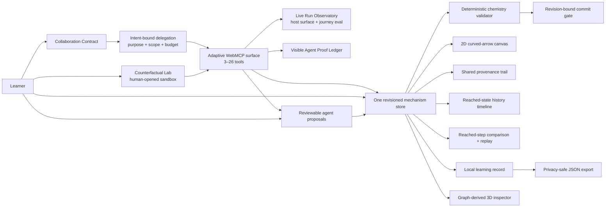

# Mechanism Canvas

[](https://github.com/mihirduvedi/mechanism-canvas/actions/workflows/deploy-pages.yml)
[](LICENSE)

Mechanism Canvas lets a chemistry student and an agent work on the same curved-arrow mechanism without giving the agent unchecked control. The learner sets the boundary, WebMCP exposes only the allowed actions, and a deterministic chemistry engine—not the model—decides whether the work is correct.

The standout workflow is a **Counterfactual Mechanism Lab**. The agent tries competing electron-flow paths away from the learner's draft, checks each one with the real validator, and can return only a reviewed proposal. A bounded session fixes the job and action budget; the Observatory and Proof Ledger show what the page exposed and what actually ran.

Organic chemistry is the first use case. The same human-agent contract can support other visual STEM tools where pixels alone do not reveal the underlying objects and rules.

[Open the clean judge demo](https://mihirduvedi.github.io/mechanism-canvas/?demo=1) · [Run the judge path](docs/JUDGE_GUIDE.md) · [Read the hackathon brief](HACKATHON.md) · [Check submission readiness](docs/SUBMISSION_CHECKLIST.md) · [Browse the docs](docs/README.md)

[](https://mihirduvedi.github.io/mechanism-canvas/?demo=1)

## Watch the demo

[](https://youtu.be/UXbloTA5bqU)

The unlisted [YouTube demo](https://youtu.be/UXbloTA5bqU) shows the complete WebMCP judge path in 2 minutes 49 seconds.

## See the proof in 60 seconds

| What to inspect | Where the proof lives |
|---|---|
| A real, stateful WebMCP workflow | Open the clean demo, create a two-path Counterfactual Lab, and start a six-action **Compare hypotheses** session. The exact prompt is in the [judge guide](docs/JUDGE_GUIDE.md). |
| Dynamic capability discovery | The discoverable surface follows visible learner intent: **16 → 21 → 15 → 4** tools across Coach, Lab, bounded exploration, and automatic expiry. |
| Page-side execution proof | The Live Run Observatory records only host-accepted registration batches. The Agent Proof Ledger records each callback, guard, revision, and page effect without saving prompts or raw outputs. |
| A complete product, not a tool demo | Six reviewed exercises share a 2D canvas, deterministic checks, reversible commits, 3D inspection, replay, reached-state diffs, local learning records, and next-practice evidence. |
| Human authority | The agent cannot change the Collaboration Contract, open or close the Lab, widen or renew a delegation, adopt a proposal, or commit learner work unless that authority was explicitly shared. |

The [hackathon brief](HACKATHON.md) maps this evidence to every official requirement and judging criterion. The [submission checklist](docs/SUBMISSION_CHECKLIST.md) separates verified repository evidence from owner-only and publication gates. The copy-ready [Devpost package](docs/DEVPOST_SUBMISSION.md) is kept in the repository so the public description stays consistent with the code and live demo.

## The problem it solves

Today's AI learning tools force a bad choice:

- A chatbot can explain a diagram, but it sits outside the learner's exact live work and can invent what changed.
- A screenshot agent can click coordinates, but pixels do not encode stable objects, coupled operations, revision conflicts, or domain invariants.
- An unrestricted copilot can finish the task, but “please do not give me the answer” is a prompt request—not an enforceable learning boundary.

That last distinction matters. A field experiment with nearly 1,000 students found that unguarded GPT access improved assisted practice performance but hurt later unassisted performance; purpose-built safeguards largely mitigated the harm ([Bastani et al., PNAS 2025](https://doi.org/10.1073/pnas.2422633122)). Mechanism Canvas turns that design lesson into product architecture.

The learner-owned **Collaboration Contract** has three modes:

- **Observe** exposes 11 core read, focus, comparison, replay, session, and receipt tools.
- **Coach** exposes 16 core tools, including bounded checks, hints, and reviewable proposals, while the learner owns every arrow and commit.
- **Collaborate** exposes up to 21 core revision-bound tools; the learner can still keep final commits learner-only.

Opening a Counterfactual Lab dynamically adds its read control plus four branch-work tools in Coach or Collaborate, taking the live catalog up to 26. Closing or completing the lab withdraws those capabilities again.

Changing the contract updates the live WebMCP tool surface. There is deliberately no Site Tool that can change the contract. The store also rejects forbidden agent calls, so hiding a tool is not the only guard.

## Why WebMCP is the necessary interface

A curved-arrow mechanism is easy to see and surprisingly hard to operate from pixels. The same dot can mean a lone pair, the same line can mean a bond, and a chemically valid step may require multiple arrows applied together. Coordinate clicks do not tell an agent which electron pair moved or whether it acted on the learner's current revision.

Only the open application possesses all three facts required for safe tutoring at once: the exact semantic graph, the learner's current permission contract, and the validator's current revision. WebMCP lets the page expose those facts and its existing commands directly instead of asking an agent to infer them or recreate the rules.

The result is not “AI that answers chemistry.” It is a shared workspace where help carries proof: what the learner asked the agent to do now, what it was allowed to discover, which semantic objects it acted on, which learner gate approved it, and which deterministic check authorized the transition.



There is no agent-only state, hidden model grader, prompt-only permission, or second implementation of the chemistry commands.

## The judge path

Open the [clean demo](https://mihirduvedi.github.io/mechanism-canvas/?demo=1) in ChatGPT's built-in browser. It starts in **Coach** mode with 16 of 26 possible tools. Open a two-path **Counterfactual Mechanism Lab**; five lab capabilities appear dynamically, producing 21 of 26. Choose **Compare hypotheses** with a six-action budget and start the bounded session. The surface contracts to the 15 tools needed for inspection, isolated branch work, and evidence. Then ask:

> Use this page's Site Tools and keep every change visible. Read the active delegation session and Counterfactual Lab. Confirm that the job has six metered actions, is bound to sn2_01 at main revision 0, and cannot change my draft. Use exactly six work calls: set Path A to only lp_o_1 → c_electrophile and check it; set Path B to lp_o_1 → c_electrophile plus bond_c_br → br_leaving and check it; compare A with B; then recommend only the validator-approved path with a short rationale. Read the proof receipts after the budget closes, distinguish lab revisions from the unchanged main revision, and stop for my decision.

Confirm the browser surface has closed to four unmetered evidence controls, including the now read-only lab. The Live Run Observatory should show **7 / 7 claims proved**, lab revision **0 → 6**, main revision **0 → 0**, and host-accepted surface events **16 → 21 → 15 → 4**. End the session in the page; the checked recommendation remains outside the main draft. Select **Add to my draft**, ask the agent to check it, then select **Commit checked step** yourself.

That journey demonstrates dynamic tool registration, multi-tool planning, agent self-correction against deterministic evidence, isolated counterfactual state, learner-authored intent, automatic capability expiry, execution proof, and a learner-only adoption gate. The [judge guide](docs/JUDGE_GUIDE.md) contains the exact route.

## Site tools

| Tool | Available in | Contract |
|---|---|---|
| `get_mechanism_state` | All modes | Read the active problem, revision, draft, check, stable entity IDs, and current collaboration contract. |
| `get_collaboration_contract` | All modes | Read the learner-owned mode, hint ceiling, commit boundary, revision, and enabled tool names. No tool can change it. |
| `get_delegation_session` | All modes | Read the learner-granted purpose, exact scope, frozen grant, current surface, status, and action budget. No tool can create or widen it. |
| `get_hypothesis_lab` | Any mode while a lab exists | Read isolated branches, validation evidence, comparison, scope, and lab revision. No tool can open or close the lab. |
| `set_hypothesis_branch` | Coach, Collaborate + active lab | Atomically set 1–4 arrows on one isolated branch without touching the main draft. |
| `check_hypothesis_branch` | Coach, Collaborate + active lab | Run the same deterministic validator on one branch and advance only lab revision. |
| `compare_hypothesis_branches` | Coach, Collaborate + active lab | Compare two checked branches and publish shared/unique arrow evidence. |
| `recommend_hypothesis_branch` | Coach, Collaborate + active lab | Stage one validator-approved branch in the existing learner proposal gate. |
| `get_agent_action_receipts` | All modes | Read privacy-minimized execution receipts incrementally, including page outcomes and before/after state stamps. |
| `get_learning_profile` | All modes | Read privacy-local cross-exercise evidence and next-practice rankings without exposing answers. |
| `inspect_mechanism_entities` | All modes | Read atom, bond, or lone-pair data for named IDs. |
| `get_activity_trail` | All modes | Read human, agent, validator, and contract events incrementally. |
| `view_mechanism_history_state` | All modes | Show only a reached state without changing committed chemistry. |
| `compare_reached_step` | All modes | Read exact graph and electron-bookkeeping changes for an active committed transition. |
| `replay_reached_step` | All modes | Present the performed arrows without applying chemistry again. |
| `focus_mechanism_entities` | All modes | Focus named entities on the visible canvas and record the action. |
| `propose_practice_plan` | Coach, Collaborate | Stage a 1–3 exercise plan for visible learner approval. |
| `propose_draft_arrows` | Coach, Collaborate | Stage 1–4 revision-bound arrows for visible learner approval without changing the draft. |
| `check_draft_step` | Coach, Collaborate | Run the deterministic validator without committing chemistry. |
| `request_scaffold` | Coach, Collaborate | Open only a hint level at or below the learner's current ceiling. |
| `switch_problem` | Coach, Collaborate | Change exercises while retaining separate local progress. |
| `add_draft_arrow` | Collaborate | Add one arrow against an expected revision. |
| `remove_draft_arrow` | Collaborate | Remove one named draft arrow against an expected revision. |
| `undo_last_commit` | Collaborate | Restore the prior structure and keep the provenance record. |
| `reset_active_exercise` | Collaborate | Clear one exercise only after explicit confirmation and a revision check. |
| `commit_checked_step` | Collaborate + learner opt-in | Commit only a current valid check token when the learner shares that authority. |

The mutating tools reject stale revisions. A draft edit invalidates its previous validation token, and a refresh never restores commit authority.

## What is implemented

- A judge-facing opening that shows the clean two-path agent sandbox result immediately, then switches to the real Lab branches and revision when a live sandbox exists.
- Six chemistry-reviewed fixtures: three SN2 exercises, two proton-transfer exercises, and a two-step ammonia-alkylation capstone with a charged intermediate.
- Clickable and keyboard-operable SVG atoms, bonds, and lone pairs.
- Atomic multi-arrow validation with distinct incomplete, invariant-error, authored-path, accepted, and invalid-input results.
- Explicit check, revision-bound commit, undo, reset, per-problem local persistence, and shared actor provenance.
- A reviewable agent-proposal gate: WebMCP can stage structured arrows, but only the learner-facing UI can accept or decline them; accepting still requires a separate deterministic check.
- Four progressive scaffold levels per exercise.
- A lazy-loaded Three.js inspector generated from the same molecular graph, including implicit hydrogens, bond order, lone pairs, formal charge, polarity, and VSEPR geometry.
- A reached-state reaction timeline that locks future states and keeps history browsing read-only.
- Reached-step evidence: a responsive before/after comparison with collision-safe shared molecule rendering, exact bond and atom-property deltas, undo-aware reachability, and an Electron Flow Replay of the performed arrows.
- Learner reflections attached to exact commits, including reversed commits, without changing chemistry revision or validation authority.
- A compact local instructor view for checks, hints, performed arrow bundles, reversals, and learner reflections.
- A privacy-local Practice Compass that derives cross-exercise evidence from exact checks, hints, and completed steps, then ranks next practice without claiming mastery.
- A second human-agent approval gate: WebMCP can stage a revision-bound practice plan, but only the learner-facing UI can start or dismiss it.
- An active-exercise JSON learning record with download and clipboard paths; the allowlisted schema omits accepted-answer definitions, unreached state graphs, validation IDs, and dedicated learner identity fields.
- A learner-owned Collaboration Contract whose three modes expose 11–21 WebMCP tools, cap agent hints, and optionally keep commits learner-only.
- Intent-Bound Delegation Sessions that freeze a purpose-specific subset against the active problem/state, meter four to eight work calls, reject cached out-of-scope tools, and collapse to three core evidence controls plus the lab control when relevant.
- A Counterfactual Mechanism Lab with two or three isolated, tab-local branches; five dynamically registered WebMCP tools; real validator checks; deterministic comparisons; and a learner-only recommendation handoff.
- A Live Run Observatory that records only host-accepted registration batches, explains all 26 capability gates, coalesces redundant refreshes, and turns the six-call Explore workflow into a seven-claim deterministic journey report.
- An Agent Proof Ledger that centrally instruments every Site Tool call, distinguishes verified, guarded, failed, and canceled outcomes, binds optional delegation action evidence, and exposes the privacy-minimized receipts to both the page and agent.
- Twenty-six top-level imperative WebMCP tools in the complete catalog, backed by the same store as the human interface and registered through an abortable adaptive surface.
- An isolated `?demo=1` session that always starts from clean SN2 reactants, reports its temporary state to the agent, and never reads or changes saved practice.

## Trust boundaries

All six fixtures are chemistry reviewed and pass automated structure, transition, and negative-case checks. The app remains a bounded educational tool, not a reaction predictor or chemistry authority.

The validator is deterministic and fixture-bound. The 3D view is explanatory rather than a quantum calculation, molecular-dynamics simulation, conformer prediction, or claim about kinetics. Progress stays in the browser: there is no account, backend, model API call, telemetry pipeline, or cloud sync. Learning-record exports are generated only after a learner selects Download JSON or Copy JSON; Mechanism Canvas does not upload them.

WebMCP support depends on a compatible host exposing `document.modelContext`. The complete manual interface still works when site tools are unavailable.

## Run and verify

Requires Node.js 24 or a current compatible Node release.

```bash
npm ci
npm run verify:submission
npm run dev
```

`npm run verify:submission` runs the full Vitest contract suite, TypeScript build, production bundle, and submission-package checks. After an approved commit has been pushed and deployed, `npm run verify:release` additionally requires a clean tracked release, exact local/`origin/main` parity, and byte-identical live JavaScript, CSS, and social artwork.

## Project map

| Area | Source of truth |
|---|---|
| Domain model and validator | `src/domain/` |
| Reviewed fixture boundary | `src/problems/` |
| Shared command store and v6 persistence | `src/store/mechanism-store.ts` |
| Collaboration Contract policy | `src/domain/collaboration-contract.ts`, `src/components/CollaborationContract.tsx`, and `docs/COLLABORATION_CONTRACT.md` |
| Intent-Bound Delegation | `src/webmcp/delegation-session.ts`, `src/components/DelegationSession.tsx`, and `docs/INTENT_BOUND_DELEGATION.md` |
| Counterfactual Mechanism Lab | `src/webmcp/hypothesis-lab.ts`, `src/components/HypothesisLab.tsx`, and `docs/COUNTERFACTUAL_MECHANISM_LAB.md` |
| WebMCP registration | `src/webmcp/register-tools.ts` |
| WebMCP Live Run Observatory | `src/webmcp/capability-surface-recorder.ts`, `src/webmcp/webmcp-run-report.ts`, `src/components/WebMcpObservatory.tsx`, and `docs/WEBMCP_LIVE_RUN_OBSERVATORY.md` |
| Agent Proof Ledger | `src/webmcp/tool-receipt-ledger.ts`, `src/components/AgentProofLedger.tsx`, and `docs/AGENT_PROOF_LEDGER.md` |
| Judge-facing opening | `src/components/AgentSandboxPreview.tsx` |
| Visible workspace | `src/components/` |
| Learning-record schema and privacy allowlist | `src/domain/learning-record.ts` and `docs/LEARNING_RECORD.md` |
| Reached-step comparison engine | `src/domain/mechanism-comparison.ts` and `docs/REACTION_DIFF.md` |
| Electron Flow Replay | `src/domain/reaction-replay.ts`, `src/components/mechanism-arrow-layout.ts`, and `docs/ELECTRON_FLOW_REPLAY.md` |
| Reviewable agent proposals | `src/store/mechanism-store.ts`, `src/components/ReasoningPanel.tsx`, and `docs/AGENT_DRAFT_PROPOSALS.md` |
| Practice Compass | `src/domain/practice-compass.ts`, `src/components/PracticeCompass.tsx`, and `docs/PRACTICE_COMPASS.md` |
| Six-fixture problem library | `src/problems/library-expansion.ts` and `docs/PROBLEM_LIBRARY_EXPANSION.md` |
| Visual system | `src/soft-orbit.css`, `src/index.css`, and `DESIGN.md` |
| Chemistry review packets | `docs/chemistry-review/` |
| Product requirements | `docs/mechanism-canvas-prd.md` |

## License

Code is available under the [MIT License](LICENSE). Chemistry fixtures and interface copy are original project content distributed with this repository under the same license.
